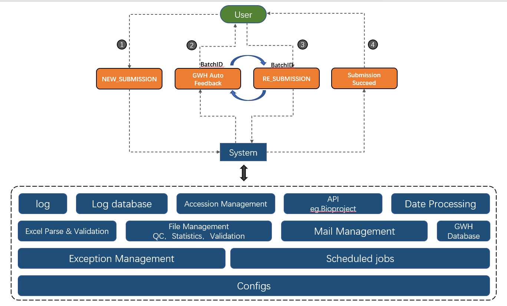
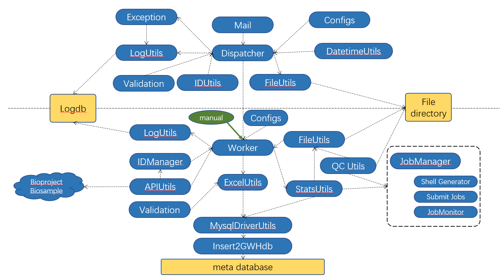

# GWH automatic batch submission toolkit


## Introduction

The tool is used to process GWH batch submissions. It manages all back-end processes automatically. An email system is embedded to provide explicit notifications to both users and administrators. It monitors the gwh eamil and reads the user's submission. parse the metadata in the excel file and validate them. fasta files along with md5 codes are validated and managed by the tool. All information generated in the submission pipeline will be inserted into the GWH database if everything pass the validation and is processed successfully.

The tools is designed to run in two modes:

1. Manual mode：
   Manually download user submission, upload it to the server, and run manual.Py with the specified parameters to complete all the above steps.

2. Automatic mode：
   Monitor gwhcuration@big.ac.cn, check emails that subjets start with NEW_ SUBMISSION and RE_SUBMISSION , extract information and automatically run the submission process.





## Structure of the tool

```
 
├── core # excel parsing, validation, file management, QC, statistics etc.
│   ├── eachJobGlobalVars.py
│   ├── exportExcel2Table.py
│   ├── fileManager.py
│   ├── gwhMeta2Mysqldb.py
│   ├── idManager.py
│   ├── mysqlManager.py
│   ├── parseAPI.py
│   ├── sqlite3Manager.py
│   ├── statFileManager.py
│   ├── validation.py
│   ├── workerConfig.ini
│   ├── workerConfig_dev_130.19.ini
│   └── workerGlobal.py
├── manager # scheduled program. this part also manage the mailbox of gwhcuratio@big.ac.cn automatically.
│   ├── batchIDUtils.py
│   ├── datetimeUtils.py
│   ├── fileUtils.py
│   ├── globalVariablesRuntime.py
│   ├── mException.py
│   ├── mMail.py
│   ├── managerConfig.ini
│   ├── managerGlobal.py
│   ├── msqlite3Manager.py
│   ├── processNewSubmission.py
│   ├── processReSubmission.py
│   └── validationUtils.py
├── LAST_SCAN_TIME.txt # Record the received datetime of the latest email in the last scan, which is used to specify the start time in the next scan
├── autoDispatcher.py # AutoDispatcher.py integrates gwhcuration@big.ac.cn The automatic detection and task scheduling function of the mailbox. After the email is parsed, the worker.py program is run for batch submission.
├── manual.py # Manual.py is the further encapsulation of worker.py and the entry of manual operation mode. 
└── worker.py # packs batch submission process.
```





## Hwo to use

1. Manual mode:  manual.py

   ```
   $ python manual.py  --help
   Usage: manual.py [OPTIONS]
   
   Options:
     -e, --excelfile TEXT          excel  [required]
     -c, --is_control              is control
     -m, --runmode [new|continue]  run mode new submission or continue
                                   submission.  [required]
   
     -b, --batchid TEXT            batchID, assign it manually in first
                                   submission, and reuse it at continue
                                   submission.  [required]
   
     -d, --dbtype [test|prod]      config file
     -f, --ftpdir TEXT             specify raw data dir
     -a, --account TEXT            user email account  [required]
     -y, --skipcheck               provide -y will skip manual check of
                                   cmd,usually used in automatic system
   
     --help                        Show this message and exit.
   
   
   For example: python manual.py  -e ../autoSubmissionV3/excels_archive/GWH-batchsubmission-Chinese-subSAM095463-update-20210913.xlsx     -m continue  -b test1  -a test@big.ac.cn  -d test
   ```

   double check `Please Double Check Your Command, Type [y/Y] If You Comfirm. :` 

   running log：

   ```
   [ date | logger | scirpt name: line number | BatchID: user;s Email | log level ]=>: detailed information
   
   For Example：
   [ 2021-09-22 14:26:57 | worker | -:- | test12:test@big.ac.cn | info ]=>: Set run status to [running]
   [ 2021-09-22 14:26:57 | worker | sqlite3Manager.py:159 | test12:test@big.ac.cn | info ]=>: Add New Batch info to logdb successfully , batchID:[test12]
   [ 2021-09-22 14:26:57 | worker | manual.py:103 | test12:test@big.ac.cn | info ]=>: Batch directory /p300/gwhOfflineBatchSubmission/gwhfileprocess/test12 not exists! creating...
   [ 2021-09-22 14:26:57 | worker | -:- | test12:test@big.ac.cn | info ]=>: Set run status to [running]
   [ 2021-09-22 14:26:57 | worker | worker.py:83 | test12:test@big.ac.cn | info ]=>: Start new submission
   [ 2021-09-22 14:26:57 | worker | worker.py:89 | test12:test@big.ac.cn | info ]=>: Manually run mode, required double check commandlines
   
   ```

   configure file for worker.py ：


   ```
   [logger]
   log_file_prefix=run_log
   
   [sender_mail]
   username=
   password=
   smtp=
   
   [mail_list] 
   system_manager = 
   
   [work_base_dir_test]
   gwhFileProcess_basedir=
   gwhFileSites_basedir=
   
   [work_base_dir_prod]
   gwhFileProcess_basedir=
   gwhFileSites_basedir=
   
   [ftp_dir]
   ftp_dir=
   fake_ftp_dir=
   
   [api]
   API_CAS_ID=
   API_GSA_BASE_URL_GETPRJ_BY_EMAIL=
   API_GSA_BASE_URL_GETSAMPLE_BY_PRJACCN=
   API_GSA_BASE_URL_GETSAMPLE_DETAIL=
   MAXID=
   
   [dsub]
   DSUB_QUEUE=
   DSUB_MEM=
   DSUB_PPN=
   DSUB_WALLTIME=
   DSUB_SCHEDD=
   
   [qc]
   PERL=
   CheckFilesCtg2xv1=
   QC_Contamination=
   Nlen=10
   
   [stats]
   stats=
   prepare-refseqs=
   flatfile-to-json=
   jbrowsetrack=
   
   [mysql_test]
   DB_HOST=
   DB_PORT=
   DB_USERNAME=
   DB_PASSWORD=
   DB_DBNAME=
   DB_CHARSETS=
   
   [mysql_prod]
   DB_HOST=
   DB_PORT=
   DB_USERNAME=
   DB_PASSWORD=
   DB_DBNAME=
   DB_CHARSETS=
   
   [datetime]
   emailReceiveDate2DatetimePattern=
   emailReceiveDate2DatetimePatternManual=
   
   [excel]
   EXCEL_SHEETS_AND_COLUMNS=
   
   
   ```

   


2. Automatic mode: autoDispatcher.py

   command：`python autoDispatcher.py`  

   autoDispatcher.py  will read the mailbox in a given period and set the subject to start with NEW_SUBMISSION as newly submitted, and the subject starts with RE_SUBMISSION as resubmitted email.


   1. NEW_SUBMISSION

      When a user submits a genome firstly, the BatchID will be assigned and recorded in the database. If there is a problem in the submission process, the error messages along with BATChID will return to the user's email, the user needs to attach the BATCHID when submitting again.

   2. RE_SUBMISSION

      If the email is a resubmitted email, the subject must be a specific format such as `RE_SUBMISSION:BATCHID=batch_2021_09_12_21_49a4f2a0-49bc-47d6-af37-9de9b8b5e161` BATCHID is a string that starts with `batch` which is returned by the previous email sent by the tool.


   Configure file：

   ```
   [mode]
   mode=test # test|prod
   
   [logger]
   log_file_prefix=
   
   [target_mail] 
   host=
   username=
   password=
   port=
   check_interval_sec=
   
   [sender_mail] 
   username = 
   password = 
   smtp = 
   
   [mail_list] 
   system_manager =
   
   [work_base_dir_test]
   gwhFileProcess_basedir=
   gwhFileSites_basedir=
   
   [work_base_dir_prod]
   gwhFileProcess_basedir=
   gwhFileSites_basedir=
   
   [datetime]
   emailReceiveDate2DatetimePattern=
   emailReceiveDate2DatetimePatternManual=
   
   ```

   


